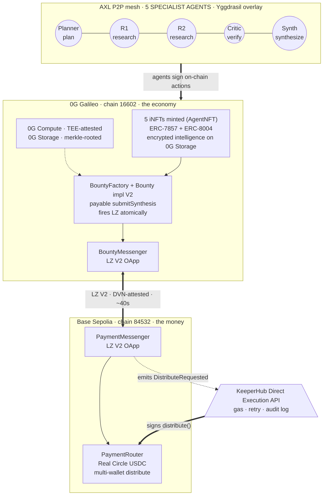

# Scholar Swarm

[](https://scholar-swarm.vercel.app)
[](https://ethglobal.com/events/agents)
[](https://chainscan-galileo.0g.ai)
[](https://sepolia.basescan.org)
[](#sponsor-track-positioning)
[](#spike-results)
[](LICENSE)

### AutoGPT for serious research.

> AutoGPT can hallucinate sources and you'd never know.
> **Scholar Swarm is five specialist iNFT agents** that fetch real sources, verify each other's claims, and run on TEE-attested inference.

Three mechanisms make the difference:

1. **Real source fetching.** Researchers retrieve web pages via a self-hosted SearXNG (or Tavily MCP — both swappable). No more "I read in some study…" — every claim carries a URL.
2. **Critic verification.** An independent agent fetches each cited URL and runs a separate attested LLM check: *does this excerpt actually support this claim?*
3. **TEE-attested inference.** Every LLM call runs on 0G Compute inside a dstack TEE. The signed attestation proves *which model produced what*, replayable by any third party.

**🌐 Live demo:** [scholar-swarm.vercel.app](https://scholar-swarm.vercel.app) ([Bounty #20 timeline](https://scholar-swarm.vercel.app/bounty/20) · [iNFT gallery](https://scholar-swarm.vercel.app/agents))
**📂 Repo:** [github.com/Himess/scholar-swarm](https://github.com/Himess/scholar-swarm)
**📧 Contact:** [@Himess__ on X](https://twitter.com/Himess__) · [@SemihCivelek on Telegram](https://t.me/SemihCivelek) · semihcvlk53@gmail.com

> 🟢 **Real testnet, not a simulation.** 1.000000 Circle USDC distributed across 5 distinct operator wallets in **0.7 seconds** via KeeperHub Direct Execution. KH's Para wallet signed `PaymentRouter.distribute()` — we never held its key. Click and verify: [tx `0xa06717e4…f0b7` on Base Sepolia](https://sepolia.basescan.org/tx/0xa06717e4495a6df75d1127bd3b61bbc18884c91cca97c04071857589cf00f0b7).

Submitted to **ETHGlobal Open Agents 2026**. Solo build by [@Himess](https://github.com/Himess).
**Status (Day 10 / 2026-04-30):** 9 contracts live on two chains (7 on 0G Galileo, 2 on Base Sepolia) · 5 iNFT agents minted to distinct operator wallets · **20/20 spikes PASS** including [Spike 18 — five OS processes, five AXL nodes, five 0G Compute ledgers, all coordinating one bounty end-to-end](#spike-results) (LZ V2 GUID `0x0c6eb880…`, 16 distinct chain txs from 5 wallets), [Spike 19 — Circle USDC distributed across 5 wallets via KeeperHub Direct Execution](https://sepolia.basescan.org/tx/0xa06717e4495a6df75d1127bd3b61bbc18884c91cca97c04071857589cf00f0b7), and [Spike 20 — SearXNG retrieval rides MCP-over-AXL end-to-end](#spike-results) (real Google results returned to a peer through the Yggdrasil mesh in 2.3s) · cross-chain payout loop closes atomically on synthesis without an off-chain coordinator · self-hosted SearXNG retrieval over the AXL mesh, cross-ISP AXL mesh, all live · **continuously running on EU VPS with 6-hour auto-bounty cadence** ([latest run](./docs/vps-runs/latest.json)).

---

## Verifiable on-chain artifacts

Every major claim in this README backs to a real testnet transaction. Use the table below as the single-click entry point — pick a row, click the link, see the artifact resolve on its native explorer.

| What we claim | One-click verification |
|---|---|
| **Real Circle USDC** (1.0) split atomically across 5 operator wallets in 0.7s · KH-signed | [`0xa06717e4…f0b7` on Basescan](https://sepolia.basescan.org/tx/0xa06717e4495a6df75d1127bd3b61bbc18884c91cca97c04071857589cf00f0b7) |
| **Synthesizer fires LayerZero V2** in the same tx as `Bounty.submitSynthesis` | [`0xa0e624d4…aff0` on 0Gscan](https://chainscan-galileo.0g.ai/tx/0xa0e624d4810779f4bc2ed30ca0229175fbb6a8ab14ed0ce4e06b16f9da1eaffc) · [LZ Scan ↗](https://testnet.layerzeroscan.com/tx/0xa0e624d4810779f4bc2ed30ca0229175fbb6a8ab14ed0ce4e06b16f9da1eaffc) |
| **5 iNFT agents (ERC-7857) minted** with AES-256-GCM encrypted intelligence on 0G Storage | [AgentNFT `0x68c0…5361` on 0Gscan](https://chainscan-galileo.0g.ai/address/0x68c0175e9d9C6d39fC2278165C3Db93d484a5361) · [iNFT gallery on frontend ↗](https://scholar-swarm.vercel.app/agents) |
| **Critic naturally rejects** a finding submitted with no source URLs (engineered scenario, real on-chain) | [`0xc01ce049…ebb3a` on 0Gscan](https://chainscan-galileo.0g.ai/tx/0xc01ce0498275a262c1a0e725c44ab3f53c75a9c39051da15ba5f3a9ed50ebb3a) · [verification doc](./docs/demo-video/REJECTION_VERIFICATION_RESULT.md) |
| **One bounty, 16 chain txs from 5 distinct signer wallets** (Spike 18 multi-process choreography) | [Bounty 20 `0xebdf9F…4eD8`](https://chainscan-galileo.0g.ai/address/0xebdf9FBAcb3172d2441FB7E067EFAB143F7F4eD8) · [timeline on frontend ↗](https://scholar-swarm.vercel.app/bounty/20) |
| **Cross-ISP AXL Yggdrasil mesh** — Türkiye laptop ↔ EU VPS bidirectional | [Spike 2b PASS in spike-results.md](./docs/spike-results.md) |
| **iNFT royalty split (95/5 ERC-2981)** — pay-to-authorize tested live | [`0xcef64b77…` on 0Gscan](https://chainscan-galileo.0g.ai/address/0x61cb7bfca6ad0cb050ab227cb22710a932582c61) · [Spike 10 PASS](#spike-results) |
| **KeeperHub workflow live on org** — `DistributeRequested` → `PaymentRouter.distribute` | [`nepsavmovlyko0luy3rpi` on app.keeperhub.com](https://app.keeperhub.com/workflows/nepsavmovlyko0luy3rpi) |
| **Live VPS swarm — auto-bounty cadence** (2 successful runs 2026-04-30: bounty 25 manual @ 4 min 45 s, bounty 26 **cron-driven** @ 4 min 50 s) | [#25 `0xc79B3d74…`](https://chainscan-galileo.0g.ai/address/0xc79B3d7400Eaa65978bc364eA019685F1C4E6e75) · [#26 `0xA0b83019…`](https://chainscan-galileo.0g.ai/address/0xA0b83019181144529d202baa2E7391E42c4C9502) · [vps-runs/latest.json](./docs/vps-runs/latest.json) |

Comprehensive spike-by-spike breakdown with every transition tx hash: [`docs/spike-results.md`](./docs/spike-results.md). Builder-side narrative of the engineering pivots: [`docs/ai-collaboration/`](./docs/ai-collaboration/).

---

## How it works (one bounty, end-to-end)

```
┌─ stage 1 · post ─────────────────────────────────────────────┐
│  USER posts a research bounty                                │
│    → Bounty contract clone created on 0G Galileo             │
└──────────────────────────────────────────────────────────────┘
                               ▼
┌─ stage 2 · plan ─────────────────────────────────────────────┐
│  PLANNER (iNFT #1) decomposes into 3 sub-tasks               │
│    → reasoning attested by 0G Compute (TEE / dstack)         │
└──────────────────────────────────────────────────────────────┘
                               ▼
┌─ stage 3 · research ─────────────────────────────────────────┐
│  RESEARCHERS (iNFT #2 + #3) bid; reputation-weighted pick    │
│    • each fetches real sources via SearXNG (Tavily swappable)│
│    • source-attributed claims                                │
│    • findings stored on 0G Storage, merkle root on-chain     │
└──────────────────────────────────────────────────────────────┘
                               ▼
┌─ stage 4 · verify ───────────────────────────────────────────┐
│  CRITIC (iNFT #4) reviews each claim:                        │
│    • HTTP-fetches every cited URL                            │
│    • independent attested LLM check: does excerpt support?   │
│    • per-claim rationale stored on 0G, reasonURI on-chain    │
└──────────────────────────────────────────────────────────────┘
                               ▼
┌─ stage 5 · synthesize + fire payout (one tx) ────────────────┐
│  SYNTHESIZER (iNFT #5) integrates approved findings only,    │
│  calls Bounty.submitSynthesis(reportRoot){value: lzFee}      │
│    → SAME TX atomically dispatches BountyMessenger via LZ V2 │
└──────────────────────────────────────────────────────────────┘
```

**The contract fires the payout — no relayer.** `Bounty.submitSynthesis` is `payable`; the Bounty itself atomically calls `BountyMessenger.notifyCompletion` in the same tx as the status flip to Completed. On Base, `PaymentMessenger._lzReceive` decodes the message and emits `DistributeRequested(guid, bountyId, recipients[], amounts[])`. KeeperHub workflow [`nepsavmovlyko0luy3rpi`](https://app.keeperhub.com/workflows/nepsavmovlyko0luy3rpi) watches that event and calls `PaymentRouter.distribute()` — gas estimation, retry, full audit log. Circle USDC lands in five distinct agent wallets on Base, proven in [Spike 19 distribute tx `0xa06717e4…`](https://sepolia.basescan.org/tx/0xa06717e4495a6df75d1127bd3b61bbc18884c91cca97c04071857589cf00f0b7) (~0.7s after KH trigger). The keeper signing `distribute()` is KH's Para wallet — we never had its key.

Run the whole pipeline yourself with `pnpm spike:17` (proven on testnet — see [Spike 17](#spike-results)).

The user gets a research report where every statement traces back to a fetched URL, every inference is cryptographically attested, and every contributor was paid for verified work — without a single trusted bot in the critical path.

---

## The five agents (live iNFTs on 0G Galileo)

Five **ERC-7857 iNFTs** minted to five distinct operator wallets at `AgentNFT` [`0x68c0175e9d9C6d39fC2278165C3Db93d484a5361`](https://chainscan-galileo.0g.ai/address/0x68c0175e9d9C6d39fC2278165C3Db93d484a5361). Each holds AES-256-GCM encrypted role definition + system prompt with the merkle root committed in `iNFT.intelligenceRoot`.

| iNFT | Role | Mint tx on 0Gscan (proof of mint) |
|---|---|---|
| #1 Planner-Alpha | Planner | [`0xe4b865af…51c37`](https://chainscan-galileo.0g.ai/tx/0xe4b865afd71bff9070b2d42109d26b6dc5b602ffd02ae48a0d8e91fbe5251c37) |
| #2 Researcher-One | Researcher | [`0x7405886a…39ffa`](https://chainscan-galileo.0g.ai/tx/0x7405886aa995eb34e0b0ef5f43f4db0819a5e946bb237bffb82ea52645f39ffa) |
| #3 Researcher-Two | Researcher | [`0x1edb1817…8be57`](https://chainscan-galileo.0g.ai/tx/0x1edb1817d524eda007e8a9beffa1d045eda6c43fde85342650538a77f08ebe57) |
| #4 Critic-Prime | Critic | [`0x87f4b714…e5211`](https://chainscan-galileo.0g.ai/tx/0x87f4b7141e915660ee60a32d815f355523cf41347d7fa3e7d246e6c01a4e5211) |
| #5 Synthesizer-Final | Synthesizer | [`0x0cb6c4d9…b1778`](https://chainscan-galileo.0g.ai/tx/0x0cb6c4d91150932a89eab960eaf0c034b1faa5a3146e95822e12a33df3ab1778) |

Visual gallery (operator wallets, intelligence roots, mint + transfer tx): [scholar-swarm.vercel.app/agents](https://scholar-swarm.vercel.app/agents). Mint artifact: [`docs/spike-artifacts/minted-agents.json`](./docs/spike-artifacts/minted-agents.json) · roundtrip code: [`scripts/mint-agents.ts`](./scripts/mint-agents.ts).

---

## Demo video & live demo

**Live frontend:** https://scholar-swarm.vercel.app — three-route demo-mode app showing real on-chain state:
- [`/`](https://scholar-swarm.vercel.app/) — bounty post form
- [`/bounty/20`](https://scholar-swarm.vercel.app/bounty/20) — full lifecycle timeline for the Spike 18 PASS bounty (5 stages, 17 real on-chain tx hashes, cross-chain payout panel, recipient cards)
- [`/agents`](https://scholar-swarm.vercel.app/agents) — five iNFT gallery (operator wallets, encrypted intelligence roots, mint + transfer tx)

Frontend source: [`frontend/`](./frontend/) — Next.js 16 + Tailwind + Framer Motion. All addresses, hashes, and explorer links resolve to real testnet entities.

**3-min demo video** records Day 11 (2026-05-02). Script outline: bounty creation → swarm coordination → critic catches a weak source → researcher retries → synthesis → **the contract fires the cross-chain payout itself** → KH workflow distributes USDC on Base → final report with per-claim source attribution. The on-camera run is `pnpm spike:18` against live testnet, with two physical machines (laptop in Türkiye + EU VPS) hosting the AXL mesh — cross-ISP round-trip already verified ([Spike 2b PASS](#spike-results)). Recording procedure + rejection-scene engineering live in [`docs/demo-video/`](./docs/demo-video/).

---

## What this repo contains

> **Two deliverables in one repo:** [`@scholar-swarm/sdk`](./packages/swarm-sdk/README.md) — a swarm-first agent framework in the OpenClaw family (N agents ⇄ 1 workflow, MIT, domain-agnostic) — and **Scholar Swarm itself**, the reference research application built on it (5 agent runtimes, 9 contracts across 2 chains, 2 LZ V2 OApps, 0G + AXL + KH adapters). Other teams fork the SDK to build code-review, legal-analysis, or investigative-journalism swarms.

Every claim above traces to a live testnet artifact. The [Verifiable on-chain artifacts](#verifiable-on-chain-artifacts) table is the single-click verification entry point; full spike-by-spike breakdown with every transition tx hash lives in [`docs/spike-results.md`](./docs/spike-results.md).

---

# Architecture

## Two chains, by design

Scholar Swarm runs on two chains because each one does a job the other can't.

- **0G Galileo Testnet (16602)** — purpose-built AI infrastructure. Attested inference (0G Compute), decentralized storage (0G Storage), per-agent on-chain identity (ERC-7857 iNFTs + ERC-8004 reputation). The economy lives here.
- **Base Sepolia (84532)** — mature payment rails. USDC at the canonical address, KeeperHub's native execution support, x402 micropayment infrastructure. Money settles here.

The two are stitched by a **trustless** cross-chain link (LayerZero V2), not a bot. See [§ Cross-chain payment via LayerZero V2](#cross-chain-payment-via-layerzero-v2).



## Smart contracts on 0G

Seven core contracts on 0G Galileo (plus a `StubVerifier` mock for the ERC-7857 verifier slot, plus 2 archived V1 deployments preserved for [Spike 11](#spike-results) historical reference):

| Contract | Address | Purpose |
|---|---|---|
| `AgentNFT` | [`0x68c0175e9d9C6d39fC2278165C3Db93d484a5361`](https://chainscan-galileo.0g.ai/address/0x68c0175e9d9C6d39fC2278165C3Db93d484a5361) | ERC-7857 + ERC-8004 IdentityRegistry unified |
| `ReputationRegistry` | [`0xE8D84bfD8756547BE86265cDE8CdBcd8cdfC8a13`](https://chainscan-galileo.0g.ai/address/0xE8D84bfD8756547BE86265cDE8CdBcd8cdfC8a13) | ERC-8004 standard |
| `ArtifactRegistry` | [`0xB83e014c837763C4c86f21C194d7Fb613edFbE2b`](https://chainscan-galileo.0g.ai/address/0xB83e014c837763C4c86f21C194d7Fb613edFbE2b) | 0G Storage hash anchors |
| `Bounty` impl **V2** | [`0xf36fEA634e48B67968567e04e75cd6b2A2698DAE`](https://chainscan-galileo.0g.ai/address/0xf36fEA634e48B67968567e04e75cd6b2A2698DAE) | Cloned per job; `configureSettlement` + payable `submitSynthesis` auto-fires LZ V2 |
| `BountyFactory` **V2** | [`0xdcCcce054BA878ecbe7dC540F9370040BEd7629d`](https://chainscan-galileo.0g.ai/address/0xdcCcce054BA878ecbe7dC540F9370040BEd7629d) | `createBountyWithSettlement` wires messenger + role fees + auto-authorizes new bounty on messenger (factory owns messenger) |
| `BountyMessenger` (LZ V2 OApp) | [`0x55b4bccdef026c8cbf5ab495a85aa28f235a4fed`](https://chainscan-galileo.0g.ai/address/0x55b4bccdef026c8cbf5ab495a85aa28f235a4fed) | Sender of `notifyCompletion` — owned by Factory V2 |
| `AgentRoyaltyVault` | [`0x61cb7bfca6ad0cb050ab227cb22710a932582c61`](https://chainscan-galileo.0g.ai/address/0x61cb7bfca6ad0cb050ab227cb22710a932582c61) | Pay-to-authorize with 95/5 owner/creator split — ERC-2981 |
| `StubVerifier` | [`0x5ceCfD0bF5E815D935E4b0b85F5a604B784CA6E5`](https://chainscan-galileo.0g.ai/address/0x5ceCfD0bF5E815D935E4b0b85F5a604B784CA6E5) | ERC-7857 verifier slot (TEE oracle is v2) |
| `Bounty` impl V1 (archive) | [`0x3905554071E2F121533EbB26Fcf7947C916299C1`](https://chainscan-galileo.0g.ai/address/0x3905554071E2F121533EbB26Fcf7947C916299C1) | Pre-LZ-integration — preserved for [Spike 11](#spike-results) historical reference |
| `BountyFactory` V1 (archive) | [`0x3fC3BA7e2700449Cde5F06a8DF6f5FA1E18201BE`](https://chainscan-galileo.0g.ai/address/0x3fC3BA7e2700449Cde5F06a8DF6f5FA1E18201BE) | Same — preserved for the original lifecycle E2E |

## Smart contracts on Base Sepolia

| Contract | Address | Purpose |
|---|---|---|
| `PaymentRouter` | [`0xda6ab98bb73e75b2581b72c98f0891529eee2156`](https://sepolia.basescan.org/address/0xda6ab98bb73e75b2581b72c98f0891529eee2156) | USDC escrow + multi-party distribute |
| USDC (canonical) | [`0x036CbD53842c5426634e7929541eC2318f3dCF7e`](https://sepolia.basescan.org/address/0x036CbD53842c5426634e7929541eC2318f3dCF7e) | Circle's Base Sepolia USDC |

## Cross-chain payment via LayerZero V2

Why LZ V2: KeeperHub doesn't support 0G — verified live on the API: *"Unsupported network: 0g"*. We needed real cross-chain message authority, not a trusted bot. LayerZero V2 endpoints on both chains are deployed and ACTIVE (verified via the LayerZero metadata API).

| Chain | EID | EndpointV2 | DVN (LayerZero Labs) |
|---|---|---|---|
| 0G Galileo | 40428 | `0x3aCAAf60502791D199a5a5F0B173D78229eBFe32` | `0xa78a78a13074ed93ad447a26ec57121f29e8fec2` |
| Base Sepolia | 40245 | `0x6EDCE65403992e310A62460808c4b910D972f10f` | `0xe1a12515f9ab2764b887bf60b923ca494ebbb2d6` |

**Two OApps, deliberately split:**
- `BountyMessenger` (0G) — emits `notifyCompletion(bountyId, recipients[], amounts[])` to the Base counterpart when a bounty's synthesis lands.
- `PaymentMessenger` (Base) — receives via `_lzReceive`, decodes, emits `DistributeRequested(messageGuid, srcEid, bountyId, srcSender, recipients, amounts)`.

**No relayer in the critical path.** The Bounty contract itself is the message sender: `Bounty.submitSynthesis(reportRoot)` is `payable` and atomically calls `BountyMessenger.notifyCompletion{value: msg.value}` in the same tx as the status flip to Completed. The synthesizer agent quotes the LZ fee off-chain, includes it as `msg.value`, and that single tx ships the cross-chain message. ([Spike 16 PASS](#spike-results) — GUID `0x6cfdf46b…`.)

KeeperHub's role on Base side: a workflow watches `DistributeRequested` events and calls `PaymentRouter.distribute()` via Direct Execution API. Gas estimation, retry on failure, and full audit log are KH's job. The split is deliberate: **LayerZero proves the message, KeeperHub ensures the resulting tx lands.** Neither layer pretends to do the other's job.

OApp source: [`contracts/src/BountyMessenger.sol`](./contracts/src/BountyMessenger.sol), [`contracts/src/PaymentMessenger.sol`](./contracts/src/PaymentMessenger.sol). The auto-fire wiring is in [`contracts/src/Bounty.sol`](./contracts/src/Bounty.sol) (`configureSettlement` + payable `submitSynthesis`) and [`contracts/src/BountyFactory.sol`](./contracts/src/BountyFactory.sol) (`createBountyWithSettlement`).

**Deployed and live (Day 5 / 2026-04-27):**

| Contract | Address |
|---|---|
| `BountyMessenger` (0G Galileo) | [`0x55b4bccdef026c8cbf5ab495a85aa28f235a4fed`](https://chainscan-galileo.0g.ai/address/0x55b4bccdef026c8cbf5ab495a85aa28f235a4fed) |
| `PaymentMessenger` (Base Sepolia) | [`0x1a4aad2bc39934fa0256e279b8a9377d708a8cd4`](https://sepolia.basescan.org/address/0x1a4aad2bc39934fa0256e279b8a9377d708a8cd4) |

First cross-chain message landed end-to-end ([Spike 9 PASS](#spike-results)):
- 0G send tx: [`0x2f758adf…ad47`](https://chainscan-galileo.0g.ai/tx/0x2f758adf57c491466b2c73aa40f1410fc114abca246fb41ca45619984a36ad47)
- LayerZero scan: [`testnet.layerzeroscan.com/tx/0x2f758adf…`](https://testnet.layerzeroscan.com/tx/0x2f758adf57c491466b2c73aa40f1410fc114abca246fb41ca45619984a36ad47)
- Base receive tx: [`0x73a02576…a5bc`](https://sepolia.basescan.org/tx/0x73a0257686d534242b5cc570727e2b9c042b9e8aa210226e379fc3d68ceca5bc)
- GUID `0x565ff853bb84954764b6d2546d40d37fb47c00aa4ea71f08829f0474389c9e45`, fee 0.345 OG, latency ~40s.

## Execution via KeeperHub

KH integrates on **three surfaces** in this build:

1. **REST Direct Execution API** — hot path for ad-hoc transfers. KH wallet `0x7109C8e3B56C0A94729F3f538105b6916EF5934B` is whitelisted as the keeper on `PaymentRouter`. End-to-end transfer verified live (Spike 4): tx [`0x6ca23a64…`](https://sepolia.basescan.org/tx/0x6ca23a6491cd17fea40d3e9a866d3028a98709bfc548bd0bf98966e2e51f921b).
2. **Hosted MCP Server** at `https://app.keeperhub.com/mcp` — workflow discovery + orchestration. 26 tools listed live (Spike 8) including `list_workflows`, `execute_workflow`, `ai_generate_workflow`, `create_workflow`, `get_execution_logs`, `execute_contract_call`, `search_protocol_actions`.
3. **Live workflow on the org** — drafted via `ai_generate_workflow` ([Spike 13](#spike-results)) and persisted via `create_workflow` ([Spike 14](#spike-results)). Workflow id [`nepsavmovlyko0luy3rpi`](https://app.keeperhub.com/workflows/nepsavmovlyko0luy3rpi). The trigger node listens for `DistributeRequested` on `PaymentMessenger`; the action node calls `PaymentRouter.distribute(bountyKey, recipients[], amounts[])`. This is what closes the cross-chain payout loop.

`@scholar-swarm/keeperhub-client` ships both `KeeperHubPaymentProvider` (REST) and `KeeperHubMCPClient` (Streamable HTTP, used in spikes 8/13/14).

**Builder Feedback Bounty submission** — six concrete actionable items:
- `wfb_` vs `kh_` token type distinction was undocumented at API level.
- `/api/chains` endpoint shows 20 chains; FAQ claims 6. Mismatch unreconciled.
- `network: ethereum-sepolia` is rejected; canonical is `sepolia` or `eth-sepolia` — not in Direct Execution docs.
- Status URL is `/api/execute/{id}/status` (suffix), not `/api/execute/status/{id}` (prefix).
- `network: 0g` returns `Unsupported`, but `/api/integrations/0g` returns 401 — suggests an integration scaffold without an active backend.
- `docs.keeperhub.com` blocks anonymous browsers (User-Agent filter), making AI tooling research harder.

## Mesh via AXL

Gensyn AXL is the inter-agent backbone. Without AXL, a centralized message broker would replace it — defeating the *trustless multi-agent* claim.

- **2-node local mesh verified** — peer ed25519 IDs `bddf078f…` ⇄ `55f1e064…`, "hello scholar swarm" delivered bidirectionally over Yggdrasil. ([Spike 2a PASS](#spike-results))
- **MCP-over-AXL with a real production tool** — Spike 3 first proved the transport (`POST /mcp/{peer_id}/{service}` round-trip via mock router); **[Spike 20](#spike-results)** closes the loop with a real upstream tool: one peer hosts a JSON-RPC router proxying a live SearXNG instance, another peer queries it via `POST /mcp/{peer_id}/searxng` and gets real Google/Bing/DuckDuckGo results back through the Yggdrasil mesh in 2.3 s. No SSH tunnel between agents, no central tool host. Source: [`infra/axl-node-b/searxng-mcp-router.js`](./infra/axl-node-b/searxng-mcp-router.js) + [`scripts/spike-20-searxng-over-axl.ts`](./scripts/spike-20-searxng-over-axl.ts).
- **`@scholar-swarm/axl-client`** — typed `AXLMessagingProvider` wrapping the local HTTP API at `:9002`.

Cross-ISP test (Spike 2b, laptop-TR ⇄ EU VPS) **PASS Day 8** — bidirectional Yggdrasil round-trip with the same `/send` + `/recv` API path that `pnpm spike:03` exercises locally. Same code, one extra line in `Peers`.

The swarm is now also **deployed live on the same EU VPS** — five `scholar-axl-*` systemd units coordinated with five `scholar-agent-*` agent runtimes (all `Restart=always`), and a cron job at `/etc/cron.d/scholar-swarm` triggers a fresh `pnpm spike:18:cli` every six hours. The most recent successful auto-run is in [`docs/vps-runs/latest.json`](./docs/vps-runs/latest.json); the live frontend at [scholar-swarm.vercel.app](https://scholar-swarm.vercel.app) reads that file and renders a pulsing badge showing wall-clock and time since completion. Bootstrap scripts: [`scripts/vps-boot-axl.sh`](./scripts/vps-boot-axl.sh), [`scripts/vps-setup-systemd.sh`](./scripts/vps-setup-systemd.sh), [`scripts/vps-setup-agent-systemd.sh`](./scripts/vps-setup-agent-systemd.sh), [`scripts/vps-cron-bounty.sh`](./scripts/vps-cron-bounty.sh).

---

## Economic accountability

Scholar Swarm uses **reputation-weighted accountability** instead of stake-slashing. When a Critic rejects a researcher's claim, the bounty enters retry — no payment is issued for the failed attempt. The agent's on-chain ERC-8004 reputation score is the substrate for our Future Work item *"reputation-weighted bid pricing,"* where established agents earn more per task than newcomers.

**Why no slashing?** Slashing requires upfront capital, which raises the barrier for new agents. Reputation-only accountability means agents can enter the swarm with zero stake but must earn their position through verified work — a softer entry, harder retention.

Sybil resistance comes from on-chain economics: bounty creation requires USDC escrow, bidding requires gas, every interaction has a cost. Free spam isn't possible.

The rejection mechanism itself was [verified live on chain](./docs/demo-video/REJECTION_VERIFICATION_RESULT.md) — a researcher emits a finding without sources, the Critic naturally rejects, the contract increments `subTask.retryCount` and the bounty reverts to `Researching`. No Critic code modified; the same logic that handles a real broken finding handles a deliberately broken one.

### Critic audit trail (per-claim rationale on 0G Storage)

Every Critic verdict is more than a boolean. For each claim the Critic checks, it records:

```
{
  claimIndex,
  sourceFetchedOk:   <bool>      // did the URL HTTP-fetch succeed?
  semanticMatch:     <bool>      // did the LLM say the excerpt supports the claim?
  notes:             <rationale> // the LLM's 1-line "why I voted this way"
}
```

The full per-claim verdict array is written to **0G Storage** as a single JSON blob, and the resulting `reasonURI` (e.g. `0gstorage://0x…`) is committed on-chain in the `ClaimReviewed` event. Anyone holding a `reasonURI` can fetch the blob from 0G and reconstruct *exactly why* the Critic approved or rejected — claim by claim, with the LLM's reasoning attached.

Implementation: [`apps/agent-critic/src/role.ts`](./apps/agent-critic/src/role.ts) — `storeRationale()` + `semanticCheck()`. Inference runs on 0G Compute (TEE-attested) so the rationale itself is verifiable, not just stored.

---

## Spike results

20 spike scripts verify each architectural assumption against live infrastructure. **20 / 20 PASS** with on-chain or live-API proof — covering 0G Compute attested inference, 0G Storage roundtrip, 5-node AXL mesh (incl. cross-ISP TR↔EU round-trip), MCP-over-AXL with real SearXNG retrieval (Spike 20), KH Direct Execution + KH MCP + KH workflow, LayerZero V2 cross-chain, iNFT royalty splits, full Bounty lifecycle, atomic LZ-fire on synthesis, multi-process choreography (Spike 18, GUID `0x0c6eb880…`), and real Circle USDC distribution (Spike 19, tx `0xa06717e4…`).

Per-spike artifact in [`docs/spike-results.md`](./docs/spike-results.md). Raw outputs in [`docs/spike-artifacts/`](./docs/spike-artifacts/). Sponsor track positioning paragraphs in [`docs/sponsor-pitches.md`](./docs/sponsor-pitches.md).

---

## SDK position — `@scholar-swarm/sdk`

A swarm-first agent framework in the OpenClaw family.

| | OpenClaw | Scholar Swarm SDK |
|---|---|---|
| Topology | 1 agent ⇄ N channels | N agents ⇄ 1 workflow |
| Config surface | `SOUL.md` / `TOOLS.md` (declarative) | `Role` subclass + provider injection (code) |
| Identity | Local user wallet | Per-agent on-chain ERC-7857 + ERC-8004 |
| Coordination | Local Gateway | P2P mesh (AXL) |
| Memory | Filesystem | 0G Storage (KV / log / blob) |
| Inference | Pluggable, often centralized | 0G Compute sealed inference (TEE-attested) |
| Best for | Personal assistants, prosumer chatbots | Multi-party workflows where outputs are paid for |

The two are complementary. Full primitives + adapter list in [`packages/swarm-sdk/README.md`](./packages/swarm-sdk/README.md).

---

## Quick start

> Requires Node 20+, pnpm 9+, Foundry, and a 0G Galileo testnet wallet with at least 5 OG. The Discord faucet at https://discord.gg/0glabs grants this on request.

```bash
git clone https://github.com/Himess/scholar-swarm
cd scholar-swarm
pnpm install
forge install --root contracts
cp .env.example .env                                 # fill keys

pnpm spike:01   # 0G Compute (~5 OG required)
pnpm spike:05   # 0G Storage roundtrip
pnpm spike:08   # KeeperHub MCP — list 26 tools
pnpm spike:09   # LayerZero V2 0G→Base
pnpm spike:14   # KeeperHub create_workflow live on org
pnpm spike:15   # Retrieval — picks SearXNG (SEARXNG_ENDPOINT) or Tavily (TAVILY_API_KEY)
pnpm spike:16   # Bounty.submitSynthesis fires LZ atomically
pnpm spike:17   # E2E orchestrator — one script, real providers, real cross-chain
pnpm spike:18   # Multi-process choreography — runs 5 AXL nodes + 5 agents
# (in another terminal) pnpm spike:18:cli  # post a bounty + observe the swarm
pnpm spike:19   # Real Circle USDC payout to 5 wallets via KH Direct Execution
pnpm spike:20   # SearXNG retrieval over MCP-over-AXL (real Google results, no SSH tunnel)

pnpm mint:agents   # mint the 5 iNFTs to your wallet

# 2-node AXL mesh (Windows; on Linux build node from infra/axl/)
cd infra/axl-node-a && ./node.exe -config node-config.json &
cd infra/axl-node-b && ./node.exe -config node-config.json &
```

**Layout:** `contracts/` (Foundry, Solc 0.8.27 + via_ir, 42 tests) · `packages/{shared,swarm-sdk,og-client,axl-client,keeperhub-client,mcp-tools}` · `apps/{agent-planner,agent-researcher,agent-critic,agent-synthesizer}` · `frontend/` (Next.js 16 demo app) · `scripts/` (spike-01…20 + mint-agents + topup-operators + vps-cron-bounty.sh) · `infra/` (5 AXL nodes per agent role + axl-node-{a,b} for the SearXNG-MCP router on Spike 20) · `docs/` (deployment, axl-vps-setup, spike-results, spike-artifacts, ai-collaboration, demo-video, vps-runs, day-by-day, sponsor-pitches).

Full deployment instructions and on-chain addresses in [`docs/deployment.md`](./docs/deployment.md).

---

## Honest known limitations

We document our own gaps so judges don't have to find them.

1. **Critic and Researcher run on the same testnet model.** 0G Galileo only has one chatbot service (`qwen-2.5-7b-instruct`). We mitigate with different system prompts + independent attestations, but genuine cross-model verification (e.g., Critic on `GLM-5-FP8` while Researchers stay on `qwen3.6-plus`) waits for mainnet, which exposes 5 distinct TEE-bound chatbot models. The architecture supports the swap drop-in: provider selection is a single field in `@scholar-swarm/og-client`.
2. **Retrieval bias.** SearXNG and Tavily cover open-web well; paywalled sources (Bloomberg, WSJ) are skipped.
3. **Same-operator collusion is auditable but not prevented.** Five distinct agent wallets in the demo make it visible. World ID for sybil resistance is the v2 answer.
4. **Demo agent wallets are funded from one dev account.** Each iNFT is owned by a distinct EOA; those EOAs are funded hierarchically for testnet convenience. Production agents would self-fund from earned payouts.
5. **Reputation cold-start is seeded.** Demo agents ship with reputation reflecting prior test runs (12 jobs, etc.) — documented in `mint-agents.ts`. A live system needs a real bootstrapping mechanism.
6. **TEE re-encryption is stubbed.** `StubVerifier` accepts any ERC-7857 re-encryption proof. Production replaces this with a dstack-bound oracle.
7. **Cross-chain message direction is one-way at MVP.** Bounty completion → payout (0G → Base) ships. Reverse direction (Base USDC fund → 0G bounty bind) follows the same pattern but isn't in the demo path.
8. **Economic viability at small bounty sizes.** Five-way fee split assumes >$50 jobs.

---

## AI tools usage

Per ETHGlobal's submission rules, AI tools may **assist** the build but cannot **create the entire project**. This section documents how AI was used and what the human (Semih Civelek) did themselves. The full audit trail lives in [`docs/ai-collaboration/`](./docs/ai-collaboration/).

### Tools used

- **Claude Web (claude.ai)** — brainstorm + pitch refinement partner. ~6-8 hours total across Days -2 to 7. Did not write code.
- **Claude Code (CLI)** — pair-programmer for implementation. Wrote scaffolding, contract iterations, spike scripts, and adapter packages **under human direction with every commit reviewed before push**.
- **Cursor / VS Code** with AI completion — primary IDE for boilerplate work.

Estimated total time: **~80-100 hours** by Day 7, of which AI assistance accelerated execution but did not replace human review.

### What the human (Semih) did personally — not AI

These were not AI-suggested. They came from the human, often after AI proposed a different approach:

1. **Project selection.** Picked Scholar Swarm over 6+ alternatives after a 4-hour brainstorm. ([decision-log D1](./docs/ai-collaboration/decision-log.md))
2. **Sponsor track choices.** 0G dual + Gensyn AXL + KeeperHub, selected based on architectural fit + pool ROI analysis I ran myself. ([D9](./docs/ai-collaboration/decision-log.md))
3. **Pivot from trusted relayer to LayerZero V2.** Pre-pivot, the design assumed a small bot relayer would shuttle messages. I caught that this contradicted the "trustless multi-agent" pitch on Day 4 and pivoted to LZ V2 after verifying endpoints exist on both chains. ([D3](./docs/ai-collaboration/decision-log.md))
4. **Bounty.submitSynthesis is `payable` and atomically fires LZ.** This is the single most architecturally important refactor of the build. AI's first instinct was a wrapper helper contract; I rejected that for an inline atomic dispatch. ([D4](./docs/ai-collaboration/decision-log.md))
5. **Story-first README structure.** "AutoGPT for serious research" hook over buzzword salad. Came from my read of judge skim patterns + Veil VPN-style receipt structure. ([D5](./docs/ai-collaboration/decision-log.md))
6. **Two physical machines for demo.** Not one laptop with 5 processes. ([D7](./docs/ai-collaboration/decision-log.md))
7. **Debugging `Transfer_NativeFailed`.** Traced via `cast 4byte` → identified LZ V2 OApp `_payNative` strict-equality requirement → fixed by sending exact quoted fee instead of adding `receive()` to Bounty. The diagnostic + fix selection took ~30 minutes. AI executed the patch.
8. **V2 backward-compat strategy.** Refactored Bounty additively (new init args optional via separate `configureSettlement`) so all 42 existing tests stayed green. ([D11](./docs/ai-collaboration/decision-log.md))

### What AI did, under direction

- Generated initial scaffold (Day 0-3 work — labeled honestly in commit `0e7e8b2` — 35 files / 21k lines but ~3.9k of those are pnpm-lock.yaml).
- First-draft Solidity contracts; then iterated based on Foundry test failures + my review.
- Spike scripts following the pattern I established in Spike 1.
- Adapter packages (og-client, axl-client, keeperhub-client, mcp-tools) implementing the provider interfaces I designed in `swarm-sdk/src/providers.ts`.
- README first drafts that I edited for tone, hook, and structural ordering.
- Foundry deploy scripts; I ran them on testnet and verified on-chain.

### Audit trail

Everything in [`docs/ai-collaboration/`](./docs/ai-collaboration/):

| File | What it is |
|---|---|
| [`PROJECT_BRIEF_v1.md`](./docs/ai-collaboration/PROJECT_BRIEF_v1.md) | Initial brief I wrote with Claude Web, before this repo existed |
| [`PROJECT_BRIEF_v2.md`](./docs/ai-collaboration/PROJECT_BRIEF_v2.md) | Locked-in brief after Claude Code's red-flag review |
| [`claude-code-feedback-v1.md`](./docs/ai-collaboration/claude-code-feedback-v1.md) | Claude Code's 5 red flags on v1, which I then fixed |
| [`claude-code-feedback-v2.md`](./docs/ai-collaboration/claude-code-feedback-v2.md) | Claude Code's green-light on v2 + scope-management warnings |
| [`decision-log.md`](./docs/ai-collaboration/decision-log.md) | 11 architectural decisions + alternatives + rationale, all attributed |
| [`day-by-day-notes.md`](./docs/ai-collaboration/day-by-day-notes.md) | What happened each day, what blocked, what unblocked |
| [`conversation-log.md`](./docs/ai-collaboration/conversation-log.md) | Direct excerpts from Claude Web/Code sessions where the human pushed back, redirected, or rejected a proposal |
| [`README.md`](./docs/ai-collaboration/README.md) | Folder index + how to read these artifacts together |

Commit history is also part of the audit. **46 commits across the build window** (2026-04-27 to 2026-04-30, 17 / 8 / 5 / 16 commits per day respectively — Day 10 spiked during the final polish push), each with an explicit topic and a body that describes the change. No "AI dump" commits — the largest is the Day 0-3 initial scaffold (`0e7e8b2`), labeled honestly with that exact phrase in its commit message.

---

## Day-by-day

12-day solo build window 2026-04-24 → 2026-05-03. Full per-day highlights table + commit cadence in [`docs/day-by-day.md`](./docs/day-by-day.md). Granular blockers/unblockers in [`docs/ai-collaboration/day-by-day-notes.md`](./docs/ai-collaboration/day-by-day-notes.md).

---

## Team

Solo build by **Semih Civelek** from Ordu, Türkiye. 80+ merged PRs across Ethereum OSS (reth, revm, Optimism, Base, Miden). Prior win: Zama Builder Track S1 with MARC.

**Contact:**
- **GitHub:** [@Himess](https://github.com/Himess)
- **X (Twitter):** [@Himess__](https://twitter.com/Himess__)
- **Telegram:** [@SemihCivelek](https://t.me/SemihCivelek)
- **Email:** semihcvlk53@gmail.com

## License

MIT. Top to bottom — SDK, contracts, agent runtimes.
